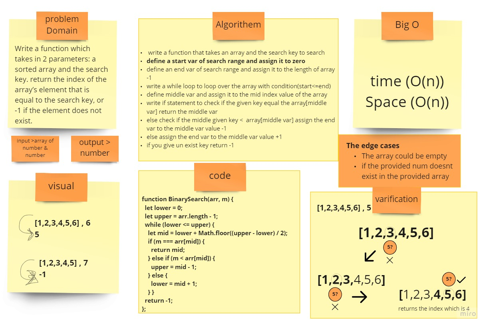

# Binary search Array

## Challenge
Write a function which takes in 2 parameters: a sorted array and the search key. return the index of the array’s element that is equal to the search key, or -1 if the element does not exist.

## Approach & Efficiency
search about binary search , defined the range of the search , finally try to change the arrange of the search

## Solution

[Binary_search_algorithm](https://en.wikipedia.org/wiki/Binary_search_algorithm)