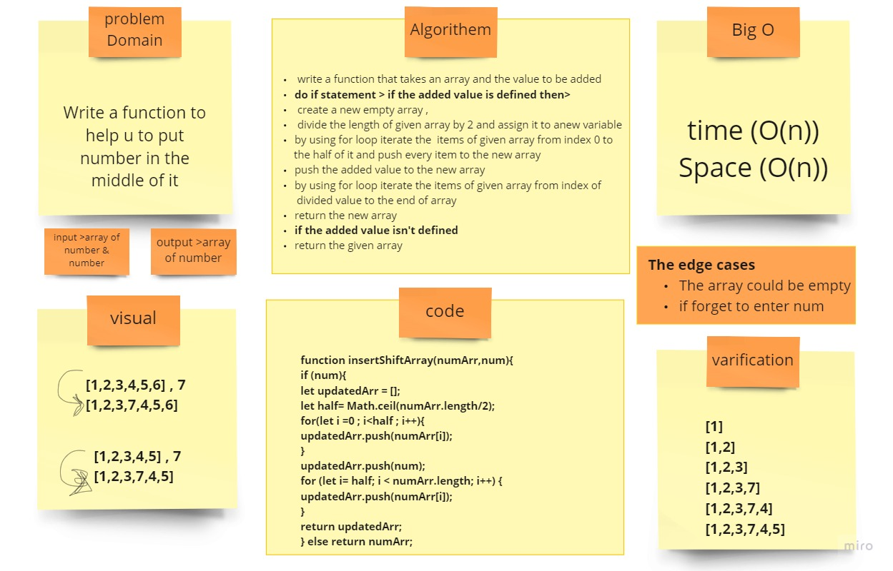

# Reverse Array 

## Challenge
Write a function which takes in an array and the value to be added. return an array with the new value added at the middle index.

## Approach & Efficiency
 write a function that takes an array and the value to be added
do if statement > if the added value is defined then>
 create a new empty array ,
 divide the length of given array by 2 and assign it to anew variable
by using for loop iterate the  items of given array from index 0 to
        the half of it and push every item to the new array

push the added value to the new array
by using for loop iterate the items of given array from index of
         divided value to the end of array

return the new array
if the added value isn't defined
return the given array

## Solution
