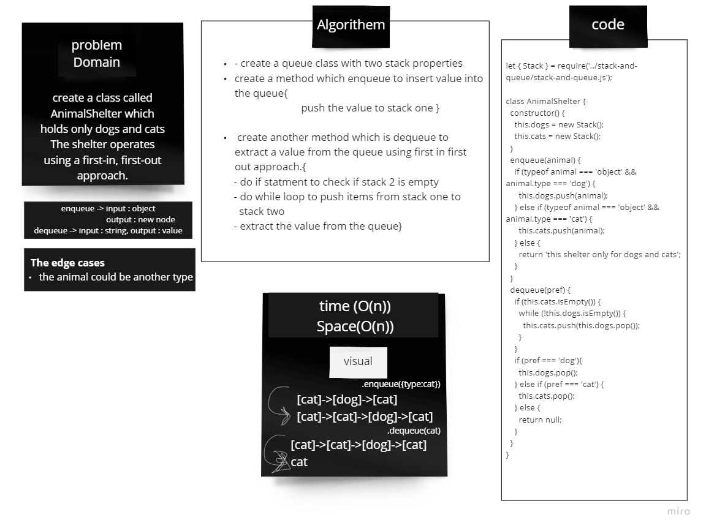

# fifo-animal-shelter

## Challenge
create a class called AnimalShelter which holds only dogs and cats The shelter operates using a first-in, first-out approach.

## Approach & Efficiency
Used a linked list with the queue data structure.

Big O: Space: O(1) Time: O(1)

## Solution
