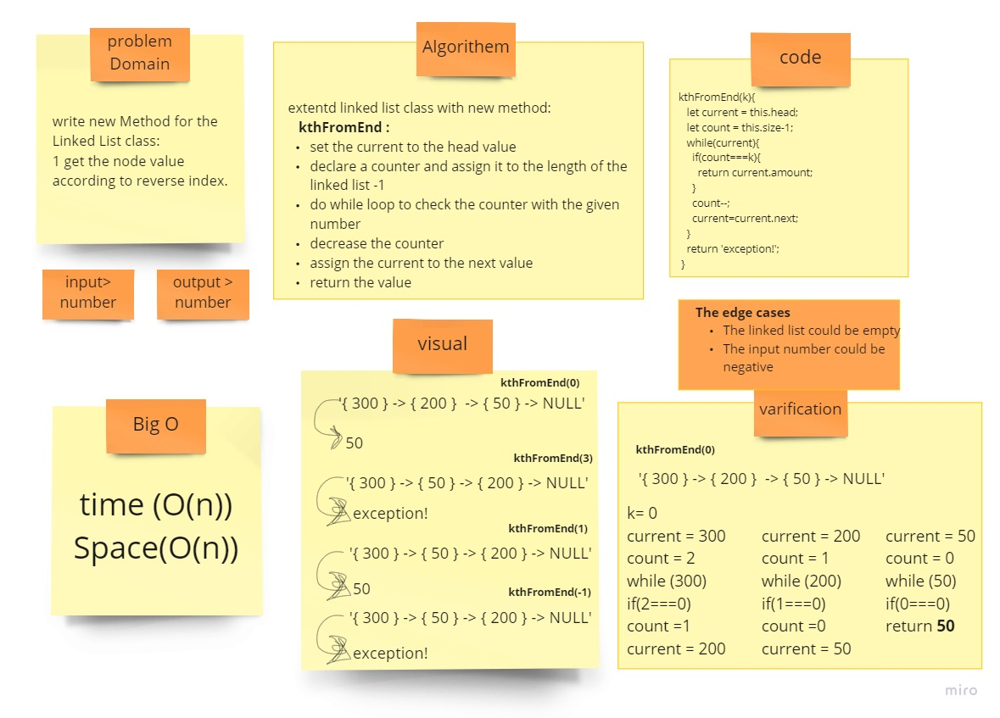

# Linked List-Insertion

## Challenge
 write new Method for the Linked List class:
1 get the node value according to reverse index.

## Approach & Efficiency
Write a method for the Linked List class which takes a number, k, as a parameter. Return the node’s value that is k from the end of the linked list.

## solution

[link to the code](./linked-list.js)