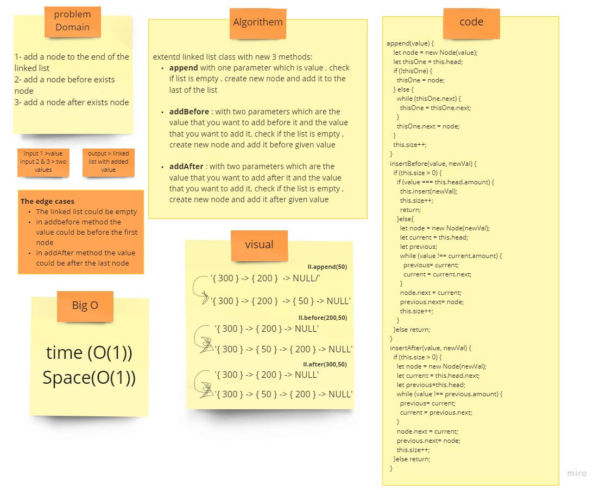

# Linked List-Insertion

## Challenge
 write Methods for the Linked List class:
1 add a node to the end of the linked list
2 add a node before exists value
3 add a node after exists value

## Approach & Efficiency
 write Methods for the Linked List class:
.append(value) which adds a new node with the given value to the end of the list
.insertBefore(value, newVal) which add a new node with the given newValue immediately before the first value node
.insertAfter(value, newVal) which add a new node with the given newValue immediately after the first value node

## solution

