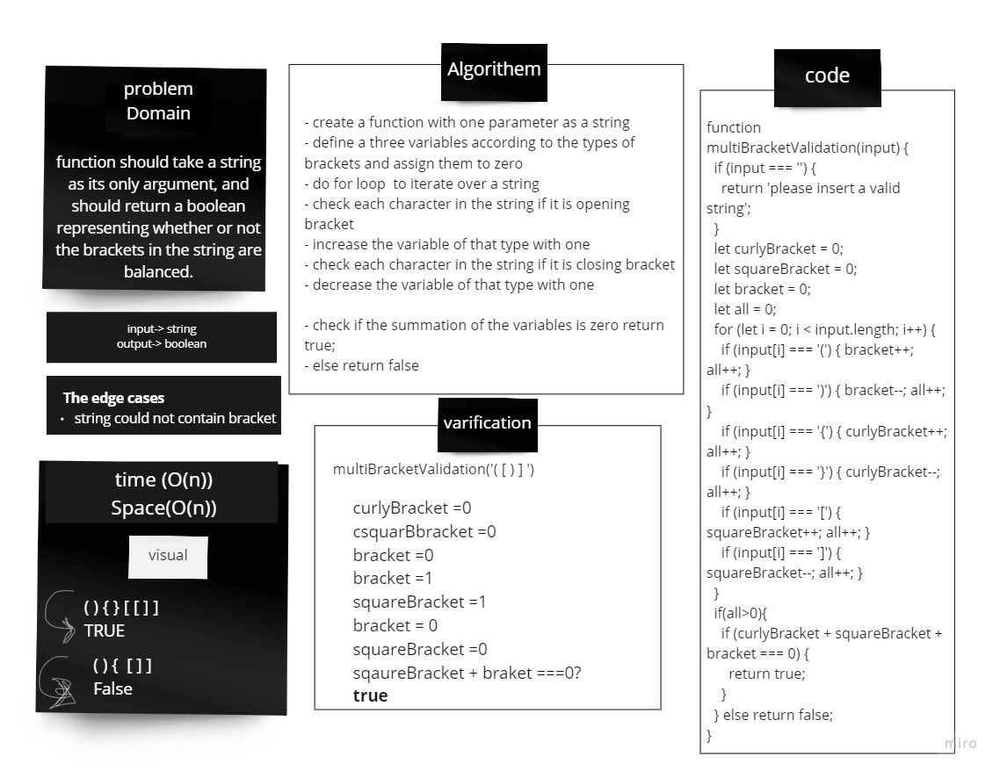

# multi-bracket-validation

## Challenge
 function should take a string as its only argument, and should return a boolean representing whether or not the brackets in the string are balanced.

## Approach & Efficiency
- create a function with one parameters as a string
- define a three variables according to the types of brackets and assign them to zero 
- do for loop  to iterate over a string
- check each character in the string if it is opening bracket
- increase the variable of that type with one
- check each character in the string if it is closing bracket
- decrease the variable of that type with one

- check if the summation of the variables is zero return true;
- else return false

## Solution
