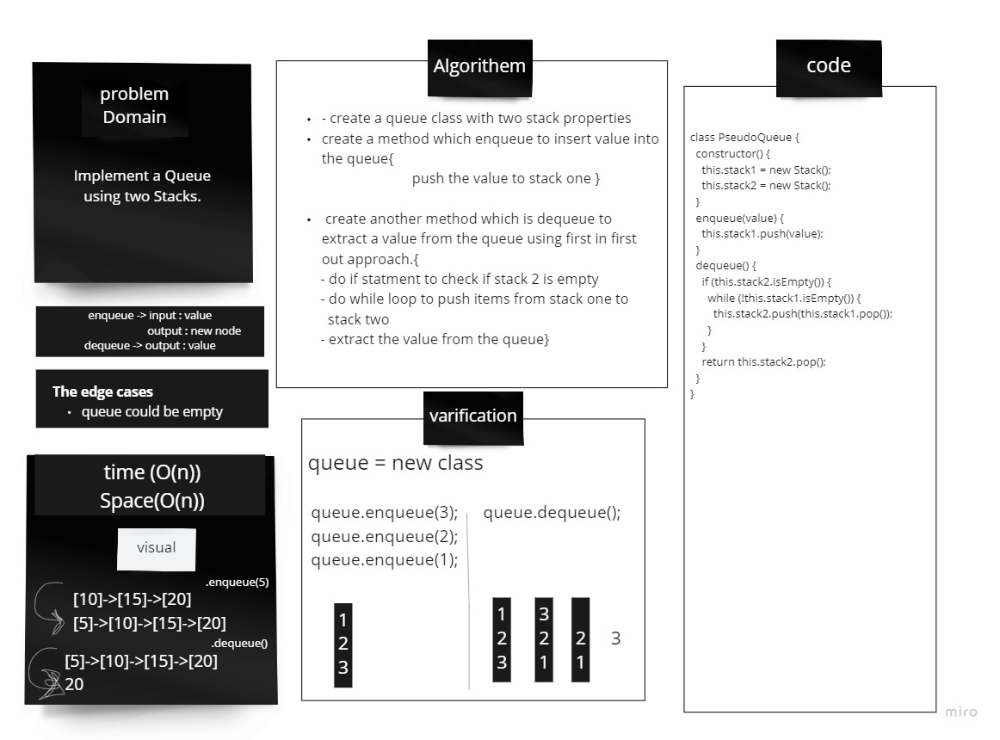

# Stack-and-Queue

## Challenge
Implement a Queue using two Stacks.

## Approach & Efficiency

### create a queue class  using two stacks, 
- create 2 methods belongs to the queue class which are
* enqueue ,
* dequeue
-> big O Time O(1), space O(n) 

## Solution
