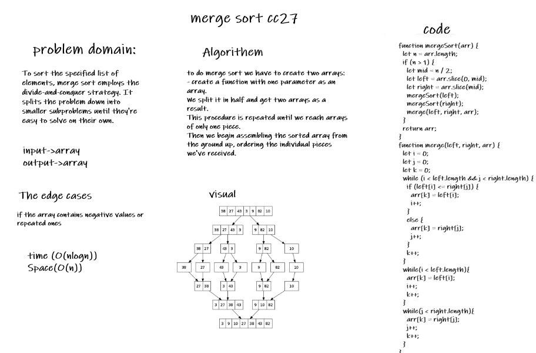

# sort Merge

### Challenge 

To sort the specified list of elements, merge sort employs the divide-and-conquer strategy. It splits the problem down into smaller subproblems until they're easy to solve on their own.

### Approach & Efficiency

Time: (O(nlogn))
Space: O(n)

### solution
