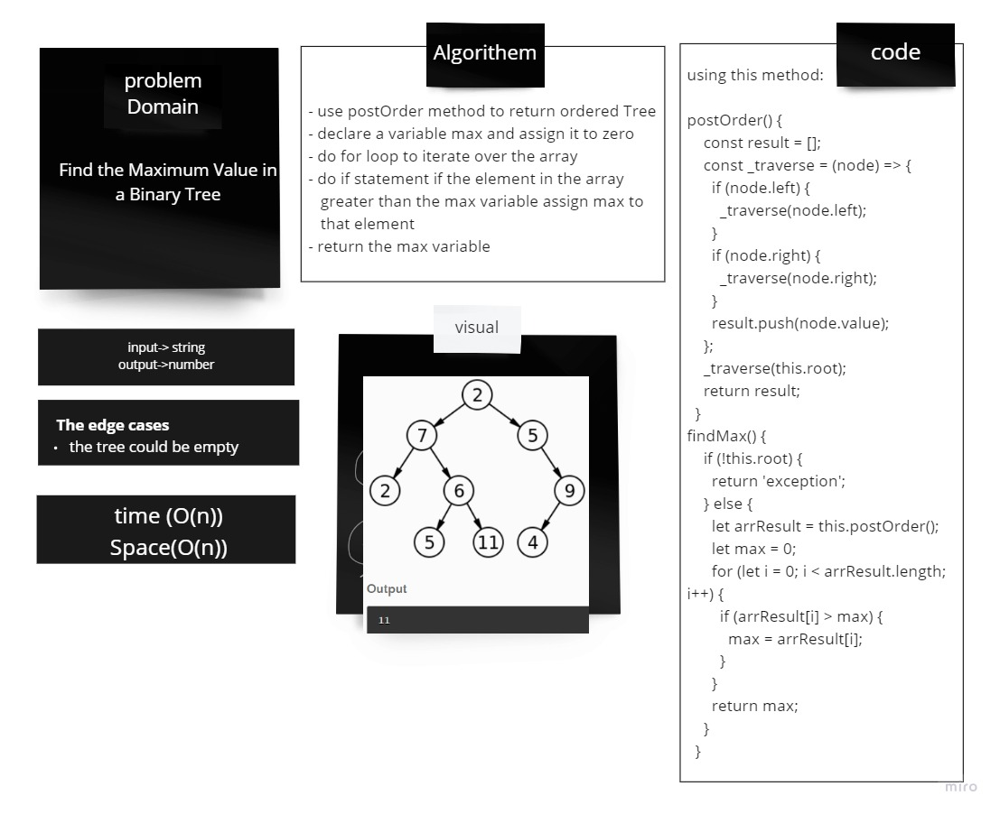
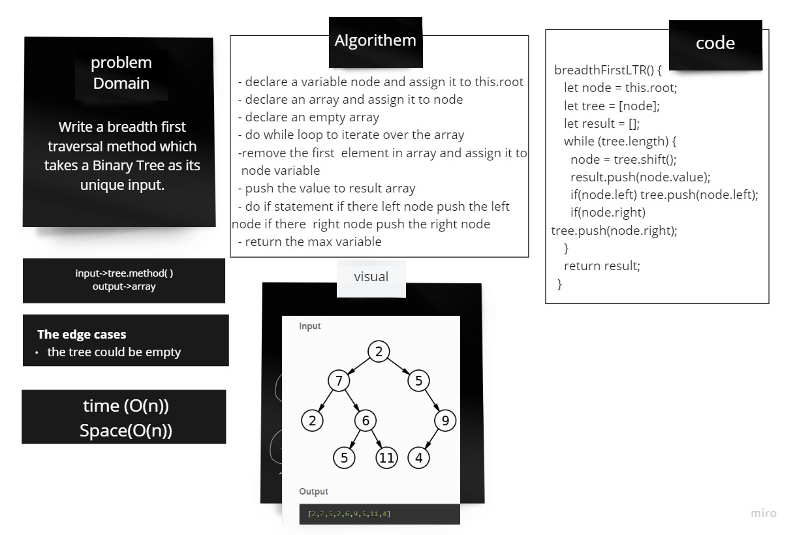

# Tree

## Challenge
Create three classes: Node, BinaryTree, and BinarySearchTree, each with its own set of methods for the root, left, and right Node, and each method doing something different to execute this tree.

## Approach & Efficiency

* BinaryTree :
Space : O(h)
Time : O(n)

* BinarySearchTree :
Space : O(h)
Time : O(log(n))

## API

- BinaryTree :

Add Three Methods preOrder, inOrder, and postOrder which returns an array of the values, ordered appropriately.

- BinarySearchTree :

Define a method named add that accepts a value, and adds a new node with that value in the correct location in the binary search tree

Define a method named contains that accepts a value, and returns a boolean indicating whether or not the value is in the tree at least once.

## find max method

## Challenge:
Find the Maximum Value in a Binary Tree

## Approach & Efficiency
  - use postOrder method to return ordered Tree
  - declare a variable max and assign it to zero
  - do for loop to iterate over the array 
  - do if statement if the element in the array greater than the max variable assign max to that element
  - return the max variable

Space : O(h)
Time : O(n)

## solution

## Challenge:
Write a breadth first traversal method which takes a Binary Tree as its unique input.

## Approach & Efficiency
  - declare a variable node and assign it to this.root

  - declare an array and assign it to node

  - declare an empty array

  - do while loop to iterate over the array

  - remove the first  element in array and assign it to node variable

  - push the value to result array

  - do if statement if there left node push the left node if there  right node push the right node

  - return the max variable

 note : we can use linked list , dequeue , enqueue methods also.
- 
## solution
