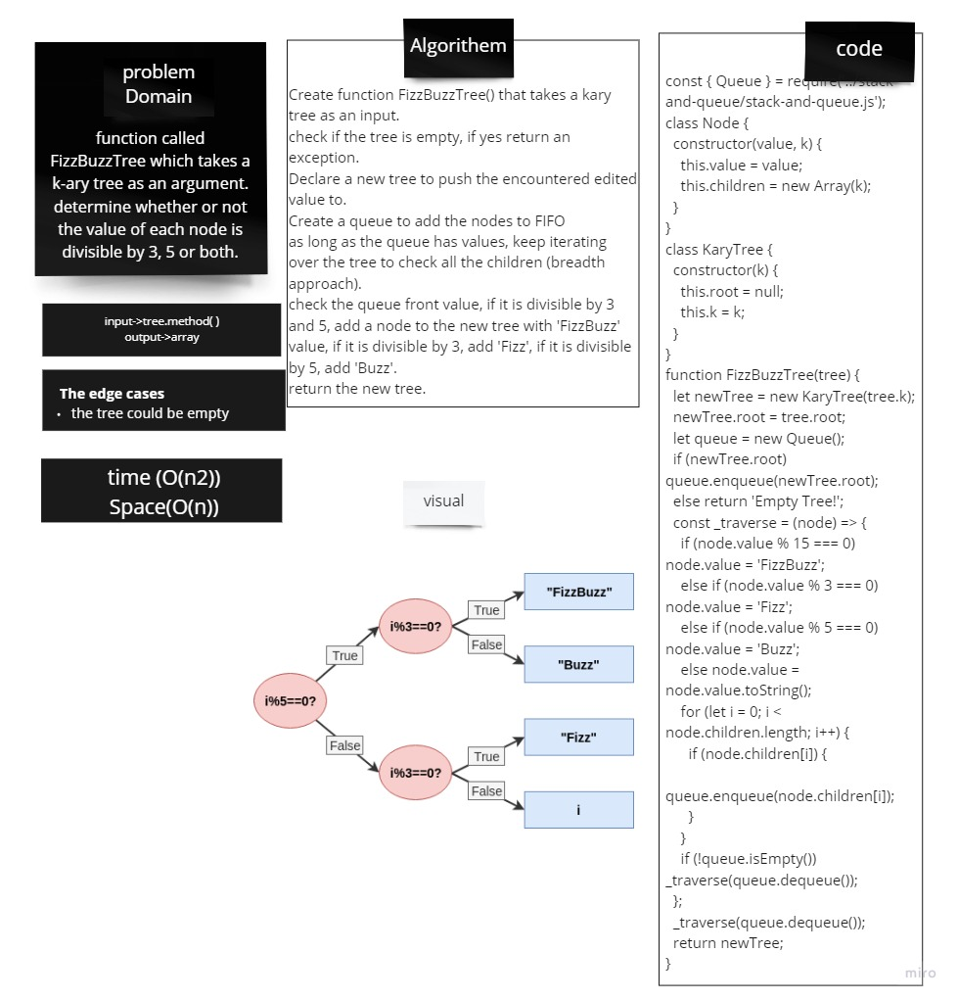

# fiz buzz

### Challenge 
Conduct “FizzBuzz” on a k-ary tree while traversing through it to create a new tree.
### Approach & Efficiency

* fizzbuzzTree :
Space : O(n)
Time : O(n2)

### solution

### colaboration
- Discussed the idea with Afnan and Raghad
- Code Fellows docs on Trees