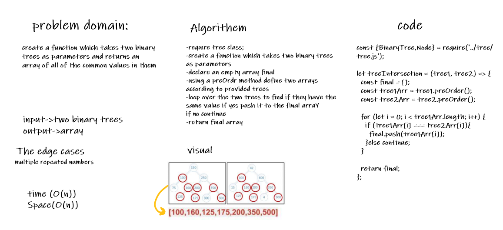

# treeIntersection

## Challenge
create a function which takes two binary trees as parameters and returns an array of all of the common values in them

## Approach & Efficiency
time (O(n))
space (O(n))

## Solution

